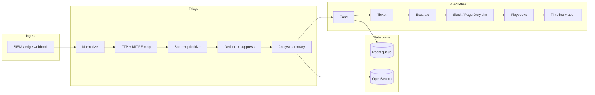

# Automated Threat Detection & Alert Triage System

Python service for **alert triage automation** (TTP-first prioritization) and **SIEM-driven incident response orchestration**. It is scoped to those two outcomes so you can explain the system cleanly in one pass—ideal for threat detection / IR internship discussions (including edge- and WAF-heavy narratives).

`triage/` normalizes SIEM payloads, classifies alerts, maps to **MITRE ATT&CK** (`config/mitre_mappings.yaml`), computes **severity** and **confidence**, **deduplicates**, **suppresses** noise, assigns **critical / high / medium / low** bands, and emits **analyst summaries**. `triage/workload.py` models baseline analyst time vs. post-automation review (~**60%** reduction for typical non-suppressed alerts). |
`workflows/` accepts SIEM-style webhooks via FastAPI (`app/main.py`), creates **cases**, **tickets**, **escalations**, **Slack** (optional live webhook) and **PagerDuty-shaped** events (simulated id), runs **automated IP block** and **user disable** playbooks (HTTP stubs), builds an **incident timeline**, and records **audit** entries. Indexed triage docs in **OpenSearch** improve searchability of what was detected and how it was handled. |

## Architecture



## Tech stack

- **Python 3.11+**, **FastAPI**, **Redis** (job queue), **Elasticsearch client** against **OpenSearch**, **Docker / Compose**, **GitHub Actions**, **pytest**, **Ruff**.

## Repository layout

| Path | Role |
| --- | --- |
| `app/main.py` | FastAPI app: `/webhooks/siem`, `/webhooks/edge`, `/health` |
| `app/settings.py` | Environment-driven configuration |
| `app/queue.py` | Redis list-backed `triage:jobs` producer |
| `triage/` | Normalization, MITRE YAML logic, scoring, dedupe, suppression, summaries, workload math |
| `workflows/` | Case, ticket, escalation, notifications, playbooks, timeline, audit |
| `storage/opensearch_store.py` | Index triage outcomes for IR search / metrics |
| `config/mitre_mappings.yaml` | Categories, ATT&CK IDs, keyword hints |
| `sample_alerts/` | Realistic SIEM / WAF-style JSON for demos and tests |
| `scripts/worker.py` | Optional Redis consumer drain |
| `tests/` | Unit + integration tests (including `TestClient`) |

## TTP prioritization (Cloudflare-aligned signals)

Priority is driven by ATT&CK mapping plus context from the YAML profile and alert fields:

- **Technique / category** (e.g. brute force → **T1110**, public exploit / WAF → **T1190**, account abuse → **T1078**).
- **Public-facing** and **edge/WAF**-style traffic boosts severity.
- **Repeated attacker IP** and **user** correlation increase score and **confidence**.
- **Critical service tier** and **credential-access** behaviors increase severity.
- **Confidence** is blended into the band via `triage/scoring.py` (`priority_band`).

## Quick start (local)

```bash
python -m venv .venv
source .venv/bin/activate  # Windows: .venv\Scripts\activate
pip install -r requirements.txt
export SIEM_SHARED_SECRET=dev-shared-secret
# Optional: REDIS_URL, OPENSEARCH_URL if you run backing services
uvicorn app.main:app --reload --port 8000
```

### Example ingest (generic SIEM)

```bash
curl -s -X POST http://127.0.0.1:8000/webhooks/siem \
  -H "Content-Type: application/json" \
  -H "X-Siem-Secret: dev-shared-secret" \
  -d @sample_alerts/siem_brute_force.json | jq .
```

### Docker Compose

```bash
docker compose up --build
```

API: `http://localhost:8000`. Set `SIEM_SHARED_SECRET` in Compose to match your `curl` header.

## Workload reduction (~60%)

`triage/workload.py` assumes ~**12 minutes** of manual work per alert (correlation, MITRE lookup, priority, narrative). After automation, analysts primarily validate escalations (~**4.8 minutes** assumed), yielding **~60%** reduction. Suppressed or duplicate alerts drop to near-dismiss time.

## MITRE examples (from `config/mitre_mappings.yaml`)

- **Brute force** → `T1110`
- **Phishing / malware IOC** → `T1566`, `T1204.002`
- **Public / WAF / app exploit** → `T1190`
- **Valid account / impossible travel** → `T1078`

## Testing

```bash
pytest tests/ -v
```

CI runs `ruff check .` and `pytest` (with a Redis service on GitHub Actions).

## Security note

This is a **portfolio / demonstration** codebase: webhook authentication is a shared secret header; playbooks POST to configurable URLs; tighten auth, secrets management, and tenancy before any production use.
